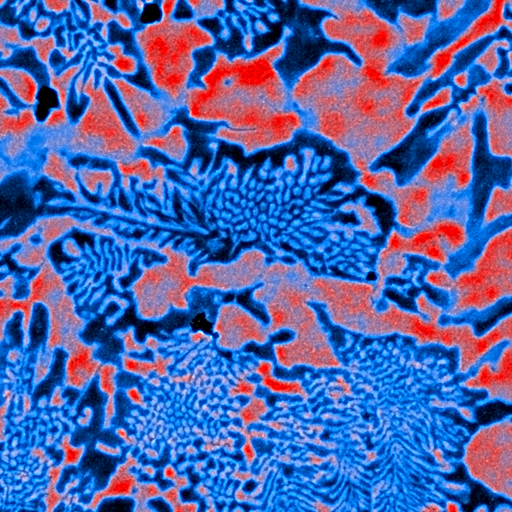
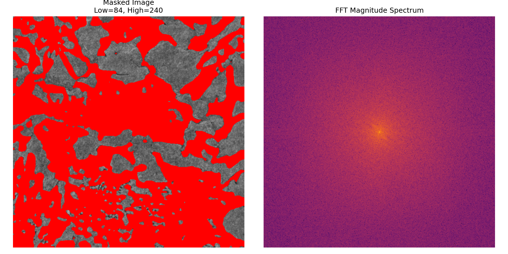

# Crystal Orientation Analysis

## Overview

This project presents a computational approach to analyzing crystal structures in electron microscopy images.

The implemented pipeline performs multi-stage image processing, including Gaussian smoothing, dual-threshold segmentation, and frequency-domain analysis using a 2D Fast Fourier Transform (FFT). The goal is to explore structural orientation patterns and evaluate the influence of segmentation parameters on frequency characteristics.

The project demonstrates modular program design, parameterized algorithms, and practical application of image processing techniques.

---

## Processing Pipeline

The implemented workflow consists of the following stages:

1. Image loading and RGB → grayscale conversion  
2. Gaussian blur preprocessing  
3. Dual-threshold intensity segmentation  
4. Optional mask inversion  
5. Application of mask to original image  
6. 2D FFT computation of the masked image  
7. Visualization and automatic saving of results  

The algorithm performs an iterative sweep over segmentation thresholds, enabling exploratory analysis of parameter influence.

---

## Project Structure

- `main.py` – program entry point  
- `config.py` – configuration parameters  
- `image_loader.py` – image loading and preprocessing  
- `segmentation.py` – mask generation logic  
- `fft_analysis.py` – frequency-domain transformation  
- `visualization.py` – result rendering and saving  

The modular structure ensures separation of concerns and improves maintainability.

---

## Configurable Parameters

The pipeline allows adjustment of:

- Gaussian blur sigma  
- Threshold ranges for segmentation  
- Iteration step size  
- Mask inversion mode  

This enables systematic experimentation and analysis of algorithm stability.

---

## Technologies Used

- Python 3  
- OpenCV  
- NumPy  
- SciPy (FFT)  
- Matplotlib  

---

## Example Results

Below are example outputs of the processing pipeline:

### Segmented Image



### FFT Magnitude Spectrum



---

## How to Run

```bash
pip install -r requirements.txt
python main.py
